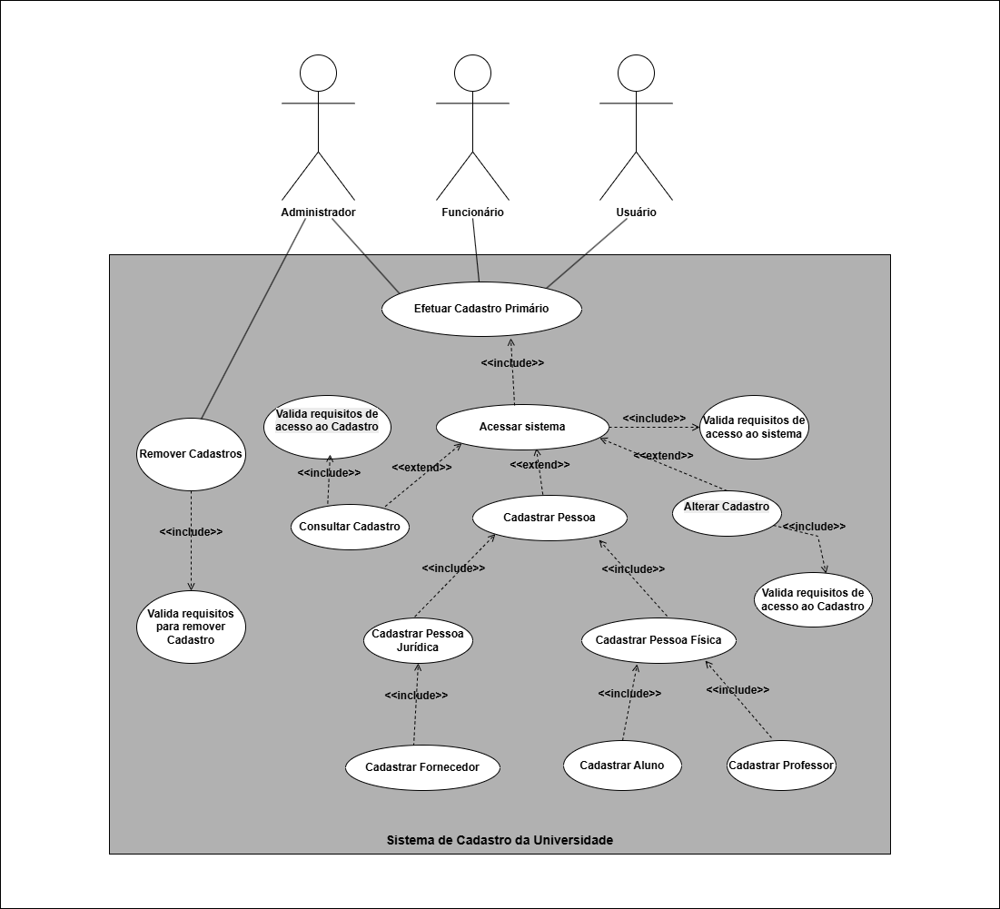
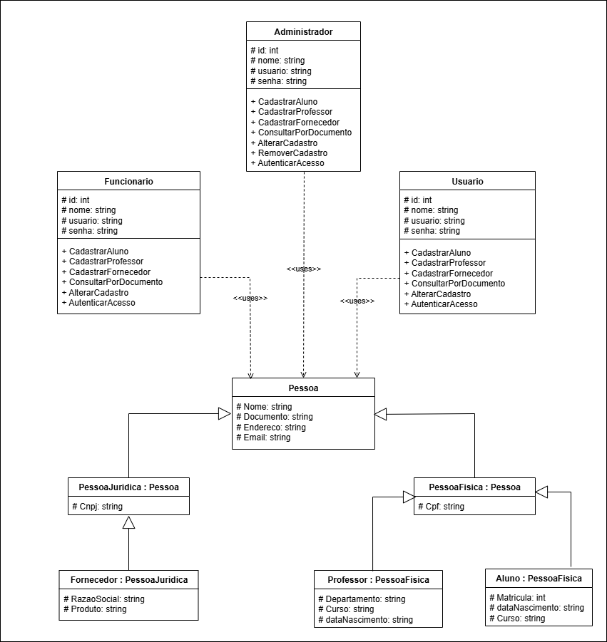
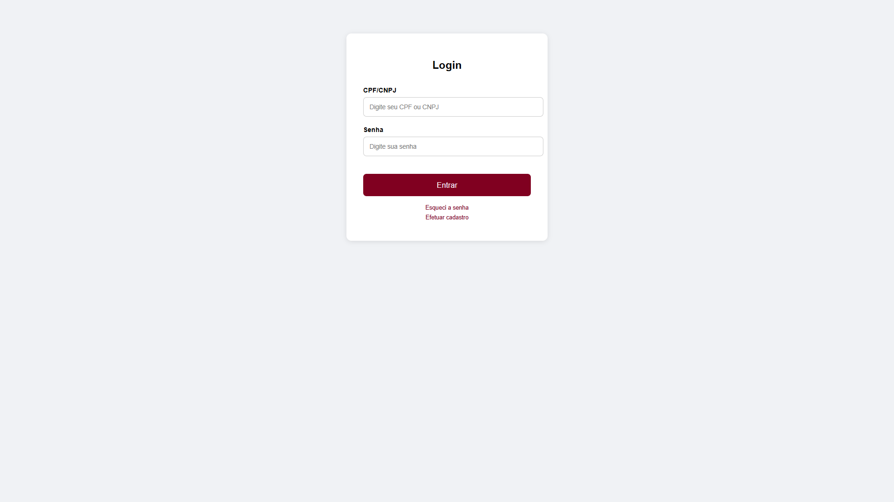
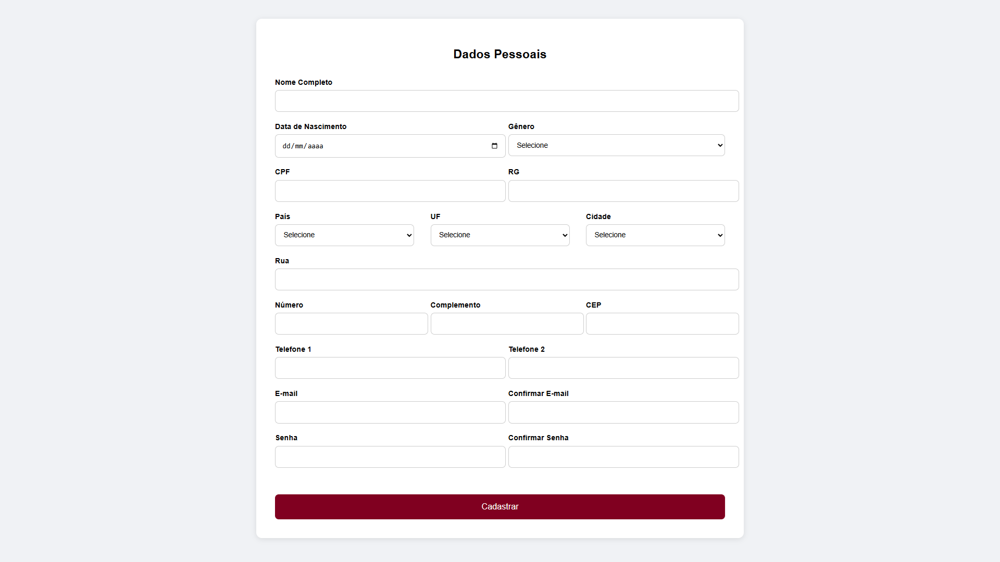
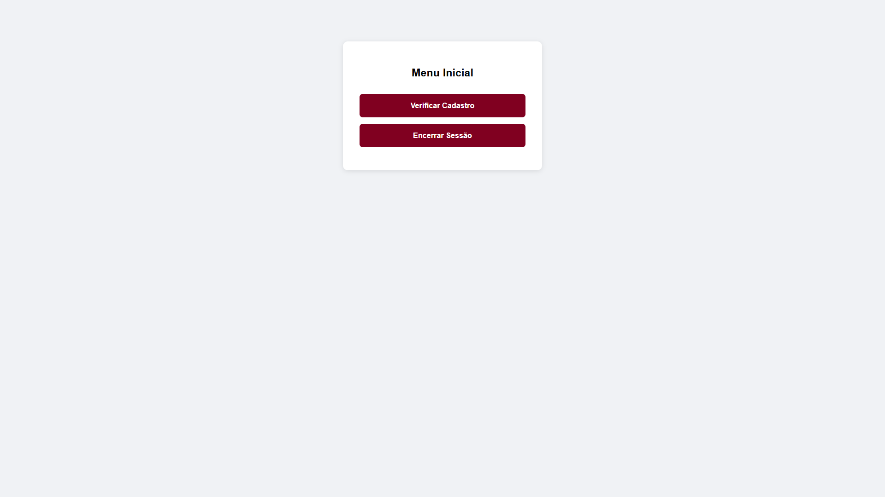
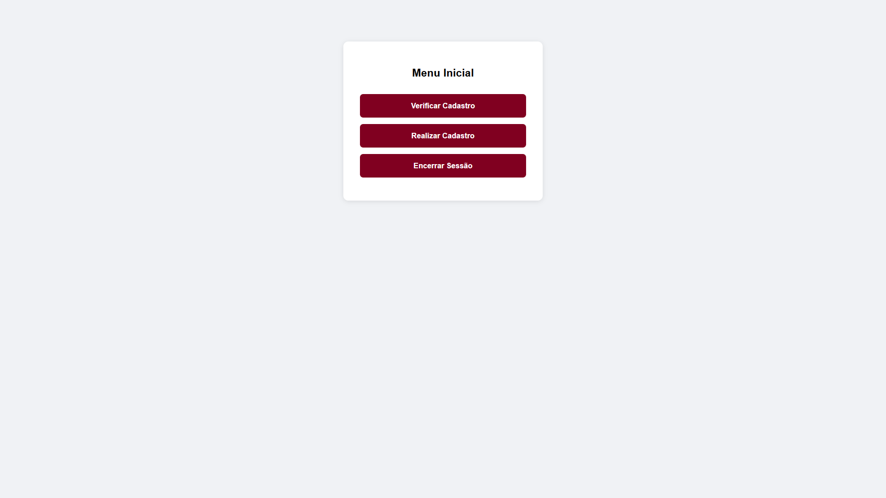
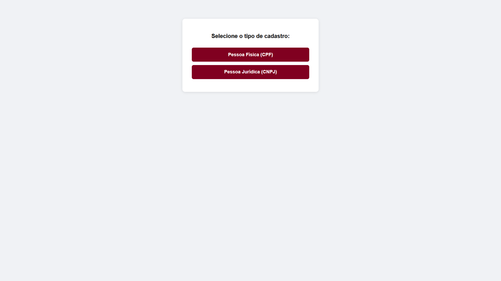
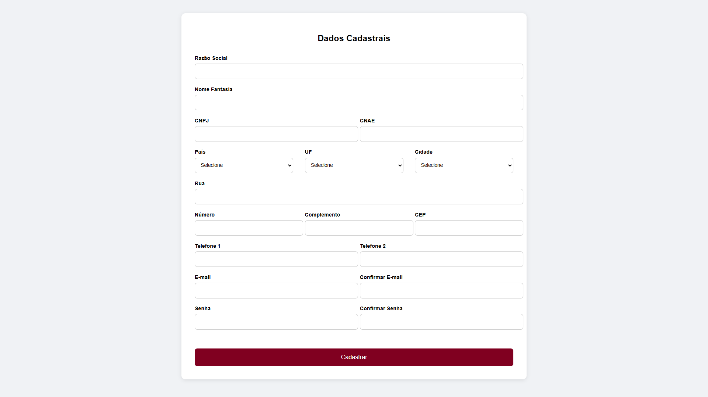
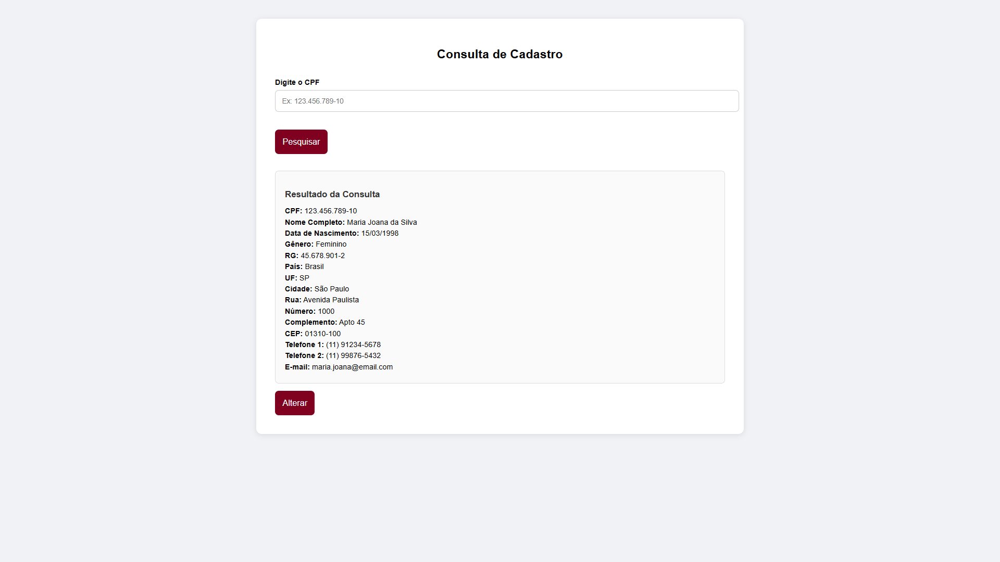
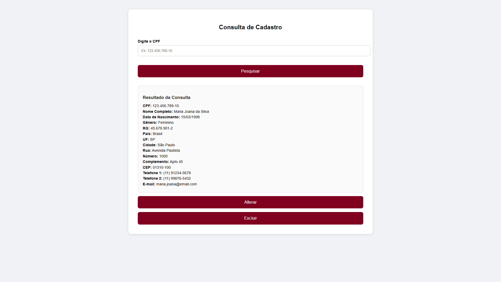

# PROJETO INTEGRADOR: DESENVOLVIMENTO DE SISTEMAS ORIENTADO À OBJETOS

## Sistema de Cadastro de uma Universidade
 

## Integrantes do Grupo
- Anaís Queiroz Goedert
- Edla Guedes Mendonça
- Fernando Kenichi Takenouchi
 

### Resumo
Este repositório corresponde à segunda entrega da matéria Projeto Integrador: Desenvolvimento de Sistemas Orientado à Objetos, do curso de Análise de Sistemas do SENAC - EAD, sob orientação do professor Enoque Leal. 
Esta etapa compreende a elaboração de protótipos de interfaces para um sistema de cadastro de dados de uma universidade. Estes protótipos estão diretamente relacionados à primeira entrega, onde foram desenvolvidos os diagramas de classe e casos de uso para a estruturação desse sistema.
Optamos pela utilização de HTML no desenvolvimento do protótipo, tanto por entender que esse sistema será utilizado via web, quanto por uma questão pessoal de aprendizado. Contudo, salientamos que a finalidade da utilização desta linguagem de marcação se dá apenas no âmbito visual dos protótipos. 
Dessa forma, nenhuma funcionalidade referente ao fluxo de navegação do sistema foi implementada.
Abaixo estão dispostas as imagens referentes às telas do sistema, bem como a descrição do fluxo.

 

NOTAS

>Consideramos que este sistema é uma ferramenta de cadastro de dados geral para pessoas que possuem vínculo institucional com uma universidade. Estas pessoas, possuidoras de um documento único de identificação como CPF ou CNPJ (e em alguns casos, MEI), podem ser alunos, professores, funcionáros, fornecedores, entre outros. Nesse sentido, entendemos que este documento único de identificação pode ser utilizado como chave primária para inserção de dados, portanto, não discriminamos os tipos de cadastro pela classificação de vínculo institucional, e sim pela chave primária de identificação no sistema, fator primário de distinção de tipo de cadastro.
Entendemos que para casos mais complexos, como emissão de NF, realização de matrícula, atribuição de disciplinas, dentre outros, um sistema mais complexo deve ser elaborado, podendo ser ele modular e flexível, de acordo com as necessidades institucionais.

 

## 1.1 Casos de Uso

## 1.2 Diagrama de Classes

## 2.1 Tela de Login

Esta imagem compreende à tela de login para todos os usuários cadastrados no sistema. Além disso, são disponibilizadas as opções de recuperação de senha e realização de cadastro primário no sistema.

## 2.2 Cadastro Geral

Este cadastro é utilizado como primeira forma de cadastro para todos os usuários, sejam eles usuários comuns, funcionários ou admnistradores. Compreendemos que para um sistema de cadastro universitário, o cadastro de fornecedores deve ser realizado unicamente por pessoas com autorização institucional, nesse caso, administradores e funcionários. Assim, esta página não contempla o formulário de cadastro de pessoa jurídica, que está disponibilizado no item 2.5.

## 2.3 Menu Inicial - Usuário Comum

Esta página inicial disponibiliza apenas as opções de visualizar o próprio cadastro e encerrar a sessão. Entendemos que o usuário comum, após cadastrado, pode apenas visualizar o próprio cadastro, disponível de forma semelhante ao item 2.3, com a opção de consulta por CPF e CNPJ ausentes.

## 2.3 Menu Inicial - Administrador e Funcionário

Esta página é semelhante ao menu do usuário, contudo, possui também a opção de realizar cadastro de um novo aluno, professor ou fornecedor no sistema. Ao selecionar a opção "Realizar Cadastro", o redirecionamento seria feito para o item 2.4.

## 2.4 Seleção do Tipo de Cadastro

Esta página corresponde à seleção do tipo de cadastro que será efetuado pelo administrador ou funcionário. Caso queira cadastrar um aluno ou professor, a opção "Pessoa Física (CPF)" deve ser escolhida. Caso queira cadastrar um fornecedor, a opção "Pessoa Jurídica (CNPJ)" Deve ser escolhida. Caso escolha a opção "Pessoa Física (CPF)", o redirecionamento será para o item 2.2.

## 2.5 Cadastro de Pessoa Jurídica

Esta página é semelhante ao cadastro geral no item 2.2, porém, inclui dados referentes à pessoa jurídica, como razão social, nome fantasia, número do CNPJ e CNAE.

## 2.6 Consulta de Dados Geral

Esta página corresponde à consulta de dados já cadastrados no sistema. Utilizamos um exemplo fictício para representar a formatação desses dados. Para o caso de uso do funcionário, é disponibilizado o local de inserção do número de documento para pesquisa, ao passo que para para o usuário comum (estudante e professor), apenas os próprios dados poderão ser consultados.

## 2.6 Consulta de Dados - Administrador

Esta página corresponde à consulta de dados cadastrados no sistema, e pode ser realizada apenas pelo administrador. Note que embora seja semelhante ao item 2.6, esta página também possui a opção de excluir o cadastro, privilegio concedido apenas a este tipo de usuário. Para que um cadastro seja excluído, é necessária a confirmação do sistema por meio da requisição de senha.

